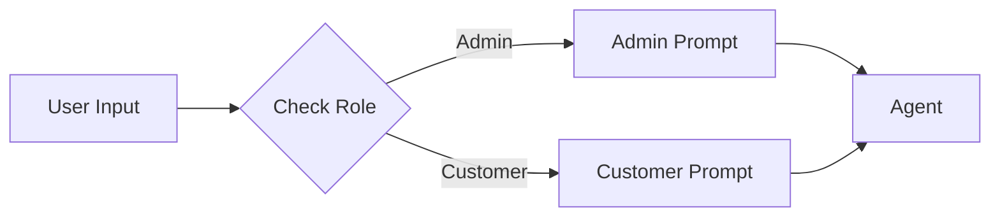
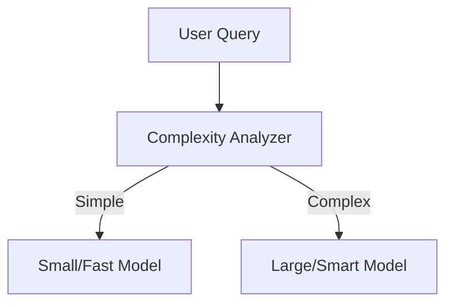
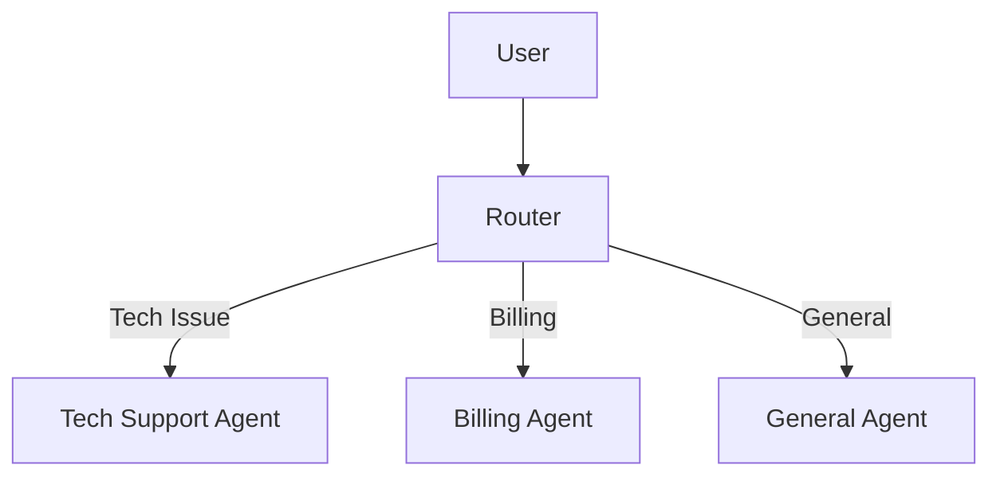

# LangChain Zero-to-Hero Part 3: Making Agents Smarter (Dynamic Behavior)

**Welcome to Part 3!** In [Part 1](./01_hello_world.md), you learned to talk to LLMs. In [Part 2](./02_tools_and_action.md), you gave them tools to interact with the world.

But right now, your agent is a bit... rigid.

It always uses the same system prompt. It always uses the same model. It treats every user exactly the same way.

**In this part, we're going to make your agent ADAPTIVE.**

We'll cover four powerful patterns to make your agent smarter:

1. **Dynamic Prompt Selection**: Changing the agent's personality based on who is talking.
2. **Smart Model Selection**: Using fast models for simple tasks and powerful models for complex ones.
3. **Conditional Tool Execution**: Checking permissions before letting the agent act.
4. **Query Routing**: Sending questions to specialized "expert" agents.

---

## Pattern 1: Dynamic Prompt Selection (The Chameleon)

One-size-fits-all prompts rarely work well in production. An admin needs technical details, while a customer needs empathy and simplicity.

Instead of hardcoding one prompt, we can select it dynamically at runtime.

### The Concept



### Implementation

Let's look at `scripts/03.a_dynamic_prompt_selection.py`:

```python
def create_dynamic_agent(user_role: str):
    # Define different prompts for different roles
    prompts = {
        "admin": "You are a security-focused admin assistant...",
        "customer": "You are a polite customer service agent...",
    }

    # Select the prompt at runtime
    system_prompt = prompts.get(user_role, prompts["customer"])

    return create_agent(model=llm, tools=[], system_prompt=system_prompt)
```

### Try It Out

Run the script to see the same question get different answers:

```bash
uv run scripts/03.a_dynamic_prompt_selection.py
```

You'll see the "Admin" agent give a technical response, while the "Customer" agent gives a friendly, simple response.

---

## Pattern 2: Smart Model Selection (The Optimizer)

Not every query needs a GPT-4 class model. Asking "What is 2+2?" to a massive model is a waste of money and time.

**Smart Model Selection** allows you to route simple queries to smaller, faster models (like Llama 3.1 8B) and complex queries to larger models (like Llama 3.3 70B).

### The Concept



### Implementation

Check out `scripts/03.b_dynamic_model_selection.py`:

```python
def get_smart_model(query: str):
    complexity = analyze_query_complexity(query)

    if complexity == "simple":
        return ChatGroq(model="llama-3.1-8b-instant")
    else:
        return ChatGroq(model="llama-3.3-70b-versatile")
```

### Try It Out

```bash
uv run scripts/03.b_dynamic_model_selection.py
```

Watch how the script selects different models based on the complexity of your request!

---

## Pattern 3: Conditional Tool Execution (The Guard)

In Part 2, we gave agents tools. But what if a tool is dangerous? You don't want just anyone deleting files.

**Conditional Tool Execution** adds logic *inside* the tool to validate permissions or inputs before executing the core logic.

### Implementation

See `scripts/03.c_conditional_tools.py`:

```python
@tool
def delete_file(user_id: str, filename: str) -> str:
    """Delete a file if user has permission."""

    # 1. Check Permissions
    if not has_permission(user_id, "delete"):
        return f"❌ Permission denied for user {user_id}"

    # 2. Validate Input
    if not filename.endswith(".txt"):
        return "❌ Invalid file type"

    # 3. Execute Logic
    os.remove(filename)
    return f"✅ Deleted {filename}"
```

### Why This Matters

This pattern is **critical** for production safety. It prevents the LLM from hallucinating valid arguments or bypassing security controls. The tool itself becomes the gatekeeper.

### Try It Out

```bash
uv run scripts/03.c_conditional_tools.py
```

---

## Pattern 4: Query Routing (The Specialist)

As your application grows, a single agent with 50 tools becomes confused and inefficient.

**Query Routing** solves this by creating specialized "sub-agents" (e.g., Tech Support, Billing, Sales) and using a "Router" to send the user to the right expert.

### The Concept



### Implementation

See `scripts/03.d_agent_routing.py`:

```python
@tool
def classify_query(query: str) -> str:
    """Classifies query as 'technical', 'billing', or 'general'."""
    # Logic to classify query...
    return category

def route_query(query: str):
    category = classify_query(query)

    if category == "technical":
        return tech_agent.invoke(query)
    elif category == "billing":
        return billing_agent.invoke(query)
```

### Try It Out

```bash
uv run scripts/03.d_agent_routing.py
```

---

## Bringing It All Together

By combining these patterns, you can build an agent that:

1. **Analyzes** the user's intent (Routing)
2. **Selects** the best model for the job (Model Selection)
3. **Adopts** the right persona (Prompt Selection)
4. **Safely executes** actions (Conditional Tools)

This is the difference between a "demo" and a "system."

---

## Your Challenge: The "Smart" Personal Assistant

Build a unified script that combines **at least two** of these patterns.

**Requirements:**

1. Create a "Manager" agent that routes queries.
2. If the user asks for "Code", route to a Developer Agent (using a coding prompt).
3. If the user asks for "Help", route to a Support Agent (using a polite prompt).
4. Implement a tool `restart_server` that only the Developer Agent can call (simulate this with a permission check).

**Bonus:** Use a smaller model for the Router and a larger model for the Developer Agent.

---

## What's Next?

Your agent is now smart and adaptive. But it still has a major flaw: **it has the memory of a goldfish.**

As soon as the script finishes, it forgets everything you said.

**In Part 4**, we'll give your agent a **long-term memory**, allowing it to remember your name, your preferences, and your past conversations.

👉 **[Continue to Part 4: Solving the Goldfish Memory Problem](./04_memory_and_context.md)**
