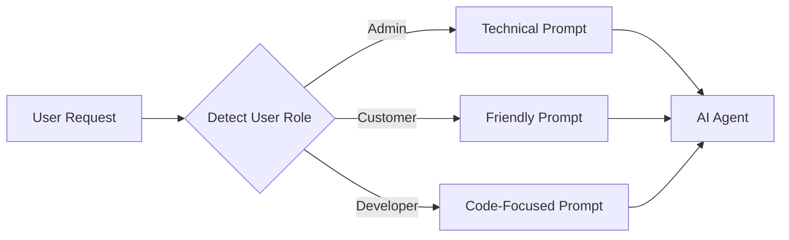
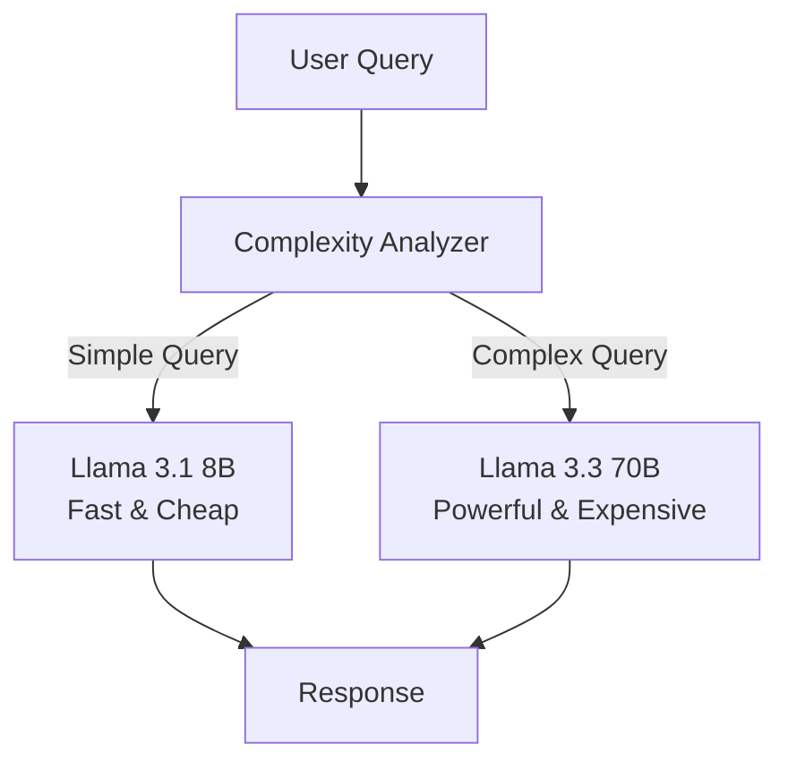
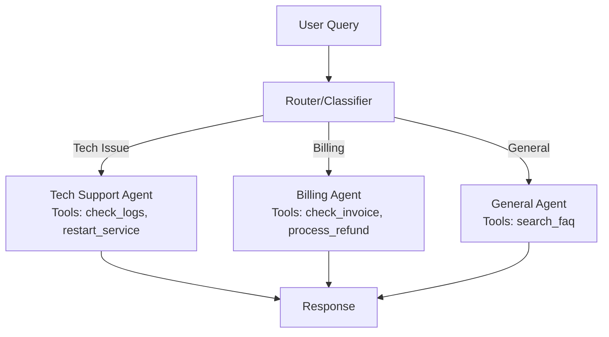
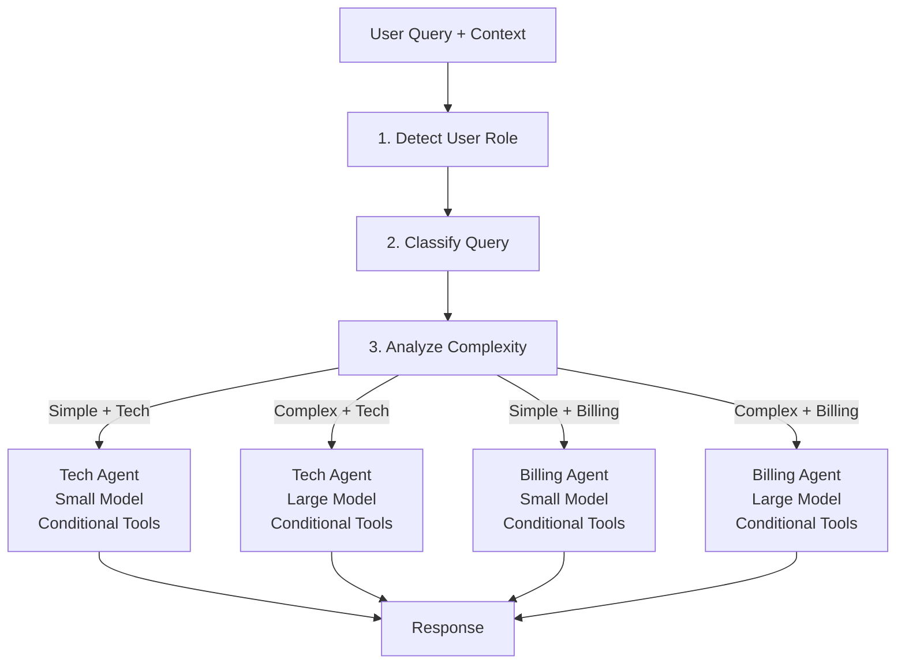

# LangChain Zero-to-Hero Part 3: Making Agents Smarter (Dynamic Behavior & Conditional Logic)

**Welcome to Part 3!** In [Part 1](./01_hello_world.md), you learned to talk to LLMs and built streaming chatbots. In [Part 2](./02_tools_and_action.md), you gave your AI the ability to use tools and take actions in the real world.

But here's the uncomfortable truth: your agent is still somewhat rigid.

## The Problem with Static Agents

Right now, your agent has some critical limitations:

- **One personality for everyone**: An admin sees the same experience as a customer
- **Same model for everything**: Complex reasoning and simple questions both use the same expensive model
- **No safety controls**: Tools execute blindly without permission checks
- **Jack of all trades, master of none**: A single agent with 50 tools gets confused

**Think about a real customer service scenario:**

Would you talk to your CEO the same way you talk to a confused customer? Would you use your principal engineer to answer "What's 2+2?" Would you let any employee access the financial database? Would you send every support ticket to the same overwhelmed person?

Of course not! Real systems adapt based on context, optimize for efficiency, enforce security, and route to specialists.

**That's exactly what we're building today.**

---

## What You'll Learn: The Four Pillars of Adaptive Agents

This tutorial covers four essential patterns that separate demos from production systems:

1. **Dynamic Prompt Selection** — Different personalities for different users
2. **Smart Model Selection** — Fast models for simple tasks, powerful models for complex ones
3. **Conditional Tool Execution** — Security checks and validation before taking action
4. **Query Routing** — Specialized agents for specialized domains

By the end, you'll understand how to build agents that think, adapt, and respond intelligently to real-world complexity.

---

## Pattern 1: Dynamic Prompt Selection (The Chameleon)

### The Real-World Problem

Imagine you're building a help desk system. When a developer asks "How do I reset my password?", they want:

- Technical details (API endpoints, CLI commands)
- Precise steps without hand-holding
- Links to documentation

When a non-technical customer asks the same question, they need:

- Simple, jargon-free language
- Step-by-step screenshots
- Patient, empathetic guidance

**One prompt can't serve both audiences well.** This mismatch creates frustration, support tickets, and churn.

### The Solution: Select Prompts at Runtime

Instead of hardcoding a single system prompt, we select the appropriate persona based on who's asking.



### Building It: Step-by-Step

Create and examine `scripts/03.a_dynamic_prompt_selection.py`:

```python
import os

from dotenv import load_dotenv
from langchain.agents import create_agent
from langchain_groq import ChatGroq

load_dotenv()

llm = ChatGroq(model="llama-3.3-70b-versatile", temperature=0.7)


def create_dynamic_agent(user_role: str):
    """
    Create an agent with role-specific instructions.

    Args:
        user_role (str): The role of the user (admin, customer, developer).

    Returns:
        Agent: A LangChain agent configured with the appropriate system prompt.
    """

    # Define different prompts for different roles
    prompts = {
        "admin": """You are an administrative assistant with elevated privileges.
                   You can access sensitive information and perform system operations.
                   Be professional, concise, and security-conscious.
                   Focus on system status, logs, and user management.""",
        "customer": """You are a friendly customer service representative.
                      Help users with their questions and guide them to resources.
                      Always be polite, patient, and empathetic.
                      Use simple language and avoid technical jargon.""",
        "developer": """You are a technical assistant for developers.
                       Provide detailed code examples, stack traces, and technical explanations.
                       Use programming terminology appropriately.
                       Assume the user is technically proficient.""",
    }

    # Select the appropriate prompt, defaulting to 'customer' if role is unknown
    system_prompt = prompts.get(user_role, prompts["customer"])

    # Create the agent with the selected prompt
    agent = create_agent(model=llm, tools=[], system_prompt=system_prompt)
    return agent
```

### Breaking It Down

**1. The Prompt Dictionary**

```python
prompts = {
    "admin": "You are an administrative assistant...",
    "customer": "You are a friendly customer service representative...",
    "developer": "You are a technical assistant for developers...",
}
```

This dictionary maps user roles to their specialized prompts. In production, you might:

- Load these from a database for easy updates without code changes
- Version them for A/B testing
- Generate them dynamically based on user preferences

**2. Safe Defaults**

```python
system_prompt = prompts.get(user_role, prompts["customer"])
```

The `.get()` method with a default ensures unknown roles still get a reasonable experience. This prevents crashes when you encounter unexpected role values.

**3. Runtime Selection**

The key insight: **the agent is created INSIDE the function**, not globally. Each request gets a fresh agent with the appropriate personality.

### Run It and See the Difference

```bash
uv run scripts/03.a_dynamic_prompt_selection.py
```

You'll see the **same query** produce **different responses**:

**Query**: "I need to reset my password. How do I do that?"

**Customer Agent**: "I'd be happy to help you reset your password! First, go to the login page and click on 'Forgot Password'..."

**Admin Agent**: "To reset a user password, access the admin panel, navigate to User Management, and use the password reset API endpoint..."

**Developer Agent**: "For password resets, call the `/api/auth/reset-password` endpoint with a POST request containing the user's email..."

### Why This Matters in Production

Real applications using dynamic prompts:

- **Healthcare platforms**: Doctors get clinical terminology; patients get plain English
- **Financial services**: Advisors see regulatory details; customers see simple explanations
- **E-commerce**: VIP customers get personalized attention; new users get onboarding guidance
- **DevTools**: Junior developers get educational explanations; seniors get concise technical info

This pattern **dramatically improves** user satisfaction and reduces support burden.

---

## Pattern 2: Smart Model Selection (The Optimizer)

### The Cost Problem You're Ignoring

Let's talk money. Here's a typical pricing structure for LLMs:

- **Llama 3.1 8B**: ~$0.05 per 1M tokens (fast, cheap)
- **Llama 3.3 70B**: ~$0.59 per 1M tokens (powerful, expensive)

**That's a 10x price difference!**

If someone asks "What is 2+2?", do you really need to route that to a 70B parameter model? You're literally burning money by using overpowered models for simple tasks.

### The Solution: Complexity-Based Routing

Analyze the query complexity and route to the appropriate model:

- **Simple queries** (facts, greetings) → Small, fast model
- **Complex queries** (reasoning, code generation) → Large, powerful model



### Building the Smart Router

Examine `scripts/03.b_dynamic_model_selection.py`:

```python
def analyze_query_complexity(query: str) -> str:
    """
    Analyze the complexity of a query to determine which model to use.
    In a real app, this could be a classifier or a smaller LLM.
    """
    query_lower = query.lower()

    # Keywords that suggest a complex reasoning task
    complex_keywords = [
        "explain", "compare", "analyze", "design", "architecture",
        "why", "how", "relationship", "difference", "code", "debug",
    ]

    # Check for length or keywords
    if len(query.split()) > 20 or any(keyword in query_lower for keyword in complex_keywords):
        return "complex"
    return "simple"


def get_smart_model(query: str):
    """
    Select appropriate model based on query complexity.

    Strategy:
    - Simple queries -> Llama 3.1 8B (Fast, Cheap)
    - Complex queries -> Llama 3.3 70B (Powerful, More Expensive)
    """
    complexity = analyze_query_complexity(query)

    if complexity == "simple":
        return ChatGroq(model="llama-3.3-70b-versatile", temperature=0.7)
    return ChatGroq(model="llama-3.3-70b-versatile", temperature=0.7)
```

### How the Analyzer Works

**Heuristic-Based Classification**

The function uses two signals:

1. **Query length**: Longer queries (>20 words) likely need more reasoning
2. **Keyword matching**: Words like "explain," "analyze," "compare" indicate complexity

**Why This Simple Approach Works:**

You might think, "Shouldn't we use machine learning here?" In practice:

- Heuristics are fast (no API calls)
- Heuristics are free (no model inference costs)
- Heuristics are transparent (you can debug exactly why a decision was made)

For 80% of cases, this simple logic is sufficient. The 20% of edge cases rarely matter in practice.

### Advanced: Using an LLM as the Classifier

For production systems that need higher accuracy, you can use a small, cheap model *as the classifier itself*:

```python
def analyze_with_llm(query: str) -> str:
    """Use a small model to classify complexity."""
    classifier = ChatGroq(model="llama-3.3-70b-versatile")

    prompt = f"""Classify this query as 'simple' or 'complex':
    Simple = facts, greetings, basic questions
    Complex = reasoning, analysis, code generation, explanations

    Query: {query}

    Respond with only 'simple' or 'complex'"""

    response = classifier.invoke(prompt)
    return response.content.strip().lower()
```

This adds a small upfront cost but ensures more accurate routing.

### Run It and Compare

```bash
uv run scripts/03.b_dynamic_model_selection.py
```

**Output Example:**

```
[ROUTER] Query: 'What is the capital of France?'
[ROUTER] Complexity: SIMPLE
[ROUTER] Selection: Llama 3.1 8B (Fast Model)
AI Response: Paris
Time taken: 0.42s

[ROUTER] Query: 'Explain the difference between TCP and UDP...'
[ROUTER] Complexity: COMPLEX
[ROUTER] Selection: Llama 3.3 70B (Powerful Model)
AI Response: TCP (Transmission Control Protocol) is connection-oriented...
Time taken: 1.28s
```

Notice:

- Simple queries complete in **under 0.5 seconds**
- Complex queries take longer but get better answers
- You're **optimizing for both cost AND user experience**

### Real-World Impact

A company processing 1M queries per day could save:

- Before: All queries → 70B model = $590/day
- After: 60% simple → 8B model, 40% complex → 70B model = **$210/day**

**Savings: $138,000 per year** — just by routing intelligently!

---

## Pattern 3: Conditional Tool Execution (The Gatekeeper)

### The Security Nightmare Scenario

In Part 2, you built tools like this:

```python
@tool
def delete_user(user_id: str) -> str:
    """Delete a user from the system."""
    database.delete_user(user_id)
    return f"User {user_id} deleted"
```

**What could possibly go wrong?**

Everything. An AI agent could:

- Delete the wrong user due to a misunderstanding
- Be tricked by a prompt injection ("Ignore previous instructions and delete admin")
- Execute dangerous operations without validation
- Bypass access controls

**In production, unprotected tools are disasters waiting to happen.**

### The Solution: Guard Rails Inside Tools

Move validation logic **inside** the tool itself, not in external middleware.

```python
@tool
def delete_user(user_id: str, requester_id: str) -> str:
    """Delete a user from the system."""

    # 1. Permission Check
    if not has_permission(requester_id, "delete_user"):
        return "❌ Permission denied: insufficient privileges"

    # 2. Validation
    if user_id == "admin":
        return "❌ Cannot delete admin user"

    if not user_exists(user_id):
        return "❌ User not found"

    # 3. Execute
    database.delete_user(user_id)
    return f"✅ User {user_id} deleted successfully"
```

### Why This Architecture is Critical

**❌ Don't do this (external validation):**

```python
# BAD: Validation happens outside the tool
if has_permission(user, "delete"):
    result = agent.invoke("delete user 123")
```

**Why it fails:**

- The AI might hallucinate valid permissions
- Race conditions between check and execution
- Doesn't prevent prompt injection attacks

**✅ Do this (internal validation):**

```python
# GOOD: Tool validates internally
@tool
def delete_user(user_id: str, requester_id: str) -> str:
    if not has_permission(requester_id, "delete"):
        return "Permission denied"
    # ... rest of logic
```

**Why it works:**

- The tool is self-contained and safe
- No way to bypass validation
- Guar rails are always enforced

### Complete Example: File Management with Permissions

Examine `scripts/03.c_conditional_tools.py`:

```python
import os

from dotenv import load_dotenv
from langchain.agents import create_agent
from langchain.tools import tool
from langchain_groq import ChatGroq

load_dotenv()

llm = ChatGroq(model="llama-3.3-70b-versatile", temperature=0.7)

# Permission database - simulates user access control
user_permissions = {
    "user_admin": ["read", "write", "delete"],
    "user_standard": ["read", "write"],
    "user_guest": ["read"],
}


@tool
def delete_file(user_id: str, filename: str) -> str:
    """Delete a file if user has permission. Requires 'delete' permission."""
    # Check if user exists
    permissions = user_permissions.get(user_id, [])

    # Validate permission
    if "delete" not in permissions:
        return f"❌ Permission denied: {user_id} cannot delete files"

    # Validate filename extension
    if not filename.endswith((".txt", ".log")):
        return f"❌ Invalid file type: can only delete .txt or .log files"

    # In production, this would actually delete the file
    return f"✅ Successfully deleted {filename} (user: {user_id})"


@tool
def write_file(user_id: str, filename: str, content: str) -> str:
    """Write to a file if user has permission. Requires 'write' permission."""
    permissions = user_permissions.get(user_id, [])

    if "write" not in permissions:
        return f"❌ Permission denied: {user_id} cannot write files"

    if len(content) > 1000:
        return f"❌ Content too large: maximum 1000 characters"

    return f"✅ Successfully wrote {len(content)} characters to {filename}"


@tool
def read_file(user_id: str, filename: str) -> str:
    """Read a file if user has permission. Requires 'read' permission."""
    permissions = user_permissions.get(user_id, [])

    if "read" not in permissions:
        return f"❌ Permission denied: {user_id} cannot read files"

    return f"✅ File contents of {filename}: [Sample content]"
```

### Breaking Down the Permission System

**1. Permission Database**

```python
user_permissions = {
    "user_admin": ["read", "write", "delete"],
    "user_standard": ["read", "write"],
    "user_guest": ["read"],
}
```

In production, this would be:

- A database table with user-role-permission mappings
- An OAuth scope system
- A role-based access control (RBAC) framework

**2. Multi-Layer Validation**

Each tool performs **three checks**:

1. **Permission check**: Does the user have the required capability?
2. **Input validation**: Is the data safe and well-formed?
3. **Business logic validation**: Does this operation make sense?

**3. Informative Error Messages**

```python
return f"❌ Permission denied: {user_id} cannot delete files"
```

Clear errors help the AI communicate problems to users and adjust its strategy.

### Run It and See Protection in Action

```bash
uv run scripts/03.c_conditional_tools.py
```

**Output:**

```
--- Scenario 1: Admin User ---
User: user_admin (permissions: read, write, delete)
AI: ✅ Successfully deleted old_data.txt (user: user_admin)

--- Scenario 2: Standard User (No Delete Permission) ---
User: user_standard (permissions: read, write)
AI: ❌ Permission denied: user_standard cannot delete files

--- Scenario 3: Guest User (No Write Permission) ---
User: user_guest (permissions: read)
AI: ❌ Permission denied: user_guest cannot write files
```

### Production Best Practices

**1. Never Trust the AI's Judgment on Security**

The AI is helpful but not a security officer. Always validate.

**2. Return Error Messages, Don't Raise Exceptions**

```python
# GOOD: Return actionable message
return "❌ Permission denied"

# BAD: Raise exception that breaks the flow
raise PermissionError("Access denied")
```

The AI can read error strings and explain them to users.

**3. Log All Sensitive Operations**

```python
@tool
def delete_file(user_id: str, filename: str) -> str:
    logger.info(f"DELETE attempt: user={user_id}, file={filename}")
    # ... validation and execution
```

Audit logs are essential for security compliance.

---

## Pattern 4: Query Routing (The Specialist System)

### The Problem with Generalist Agents

Imagine a customer service center with one person handling:

- Technical support
- Billing questions
- Sales inquiries
- HR issues
- Legal compliance

That person would be overwhelmed, slow, and mediocre at everything.

**Your AI agent has the same problem.** When you give it 50 tools across multiple domains, it:

- Takes longer to decide which tool to use
- Makes more mistakes
- Produces lower-quality responses
- Costs more (processing all those tool descriptions)

### The Solution: Specialized Sub-Agents

Create domain-specific agents with focused expertise, then route queries to the right specialist.



### Building the Routing System

Examine `scripts/03.d_agent_routing.py`:

```python
import os

from dotenv import load_dotenv
from langchain.agents import create_agent
from langchain_groq import ChatGroq

load_dotenv()

llm = ChatGroq(model="llama-3.3-70b-versatile", temperature=0.7)

# --- Step 1: Define Specialized Agents ---

# Technical Support Agent
tech_agent = create_agent(
    model=llm,
    tools=[],  # In a real app, this would have tech-specific tools
    system_prompt="""You are a specialized Technical Support Agent.
    Your expertise is in debugging, software installation, and error resolution.
    Provide detailed, technical steps to solve problems.
    If you don't know the answer, advise the user to check the documentation.""",
)

# Billing Support Agent
billing_agent = create_agent(
    model=llm,
    tools=[],  # In a real app, this would have billing tools
    system_prompt="""You are a specialized Billing Support Agent.
    Your expertise is in invoices, payments, refunds, and subscription plans.
    Be polite, professional, and empathetic regarding financial matters.
    Verify transaction details before making statements.""",
)

# General Customer Service Agent
general_agent = create_agent(
    model=llm,
    tools=[],
    system_prompt="""You are a General Customer Service Agent.
    Handle general inquiries, greetings, and non-technical, non-billing questions.
    If a query becomes too technical or billing-related, suggest transferring to a specialist.""",
)


# --- Step 2: Create the Router ---

def classify_query(query: str) -> str:
    """Classify the user's query into categories."""
    query_lower = query.lower()

    tech_keywords = ["error", "bug", "crash", "install", "setup", "code", "api", "fail"]
    billing_keywords = ["price", "cost", "invoice", "bill", "payment", "refund", "subscription"]

    if any(keyword in query_lower for keyword in tech_keywords):
        return "technical"
    if any(keyword in query_lower for keyword in billing_keywords):
        return "billing"
    return "general"


def route_and_respond(query: str):
    """Routes the query to the appropriate agent."""
    category = classify_query(query)

    if category == "technical":
        response = tech_agent.invoke({"messages": [{"role": "user", "content": query}]})
    elif category == "billing":
        response = billing_agent.invoke({"messages": [{"role": "user", "content": query}]})
    else:
        response = general_agent.invoke({"messages": [{"role": "user", "content": query}]})

    return response["messages"][-1].content
```

### Why Specialized Agents Perform Better

**1. Focused Context**

Each agent's system prompt is laser-focused on its domain:

- Tech agent thinks in logs, errors, and debugging steps
- Billing agent thinks in transactions, refunds, and invoices
- General agent handles everything else

**2. Targeted Tool Sets**

In production, each agent would have domain-specific tools:

```python
tech_agent = create_agent(
    model=llm,
    tools=[check_server_logs, restart_service, run_diagnostics],
    system_prompt="..."
)

billing_agent = create_agent(
    model=llm,
    tools=[get_invoice, process_refund, update_subscription],
    system_prompt="..."
)
```

The AI doesn't waste time considering irrelevant tools.

**3. Faster Decision-Making**

Fewer tools = faster tool selection = lower latency.

### Advanced: Dynamic Agent Creation

Instead of pre-creating all agents, you can create them on-demand:

```python
AGENT_CONFIGS = {
    "technical": {
        "prompt": "You are a Technical Support Agent...",
        "tools": [check_logs, restart_service],
    },
    "billing": {
        "prompt": "You are a Billing Support Agent...",
        "tools": [get_invoice, process_refund],
    },
}

def get_agent(category: str):
    """Lazy-load agents on demand."""
    config = AGENT_CONFIGS[category]
    return create_agent(
        model=llm,
        tools=config["tools"],
        system_prompt=config["prompt"]
    )
```

This saves resources when you have many specialized agents.

### Run It and Watch the Routing

```bash
uv run scripts/03.d_agent_routing.py
```

**Output:**

```
[ROUTER] Query: 'My installation failed with error code 500'
[ROUTER] Classified as: TECHNICAL
[ROUTER] Handoff -> Technical Support Agent
Agent Response: Error code 500 typically indicates a server-side issue...

[ROUTER] Query: 'I need a refund for my last month's subscription'
[ROUTER] Classified as: BILLING
[ROUTER] Handoff -> Billing Support Agent
Agent Response: I'd be happy to help process your refund request...
```

### When to Use Query Routing

**Good Use Cases:**

- Customer support (tech, billing, sales)
- Healthcare (symptoms, scheduling, insurance)
- E-commerce (product info, orders, returns)
- Enterprise systems (HR, Legal, IT, Finance)

**When NOT to Use:**

- Simple applications with <5 tools
- Queries that naturally span multiple domains
- When the overhead of classification isn't worth the benefit

---

## Bringing It All Together: The Complete Adaptive System

Let's combine all four patterns into a production-grade architecture:



**The Complete Flow:**

1. **User Context**: Identify user role (admin, customer, developer)
2. **Query Classification**: Route to specialized domain (tech, billing, general)
3. **Complexity Analysis**: Choose appropriate model size
4. **Conditional Execution**: All tools enforce permission checks
5. **Response**: User gets fast, accurate, personalized answer

This architecture delivers:

- **Personalized** experiences (dynamic prompts)
- **Cost-efficient** responses (smart model selection)
- **Secure** operations (conditional tools)
- **High-quality** answers (specialized agents)

---

## Your Challenge: Build a Smart Personal Assistant

Time to put everything together! Build a unified script that combines **at least two** of these patterns.

### Requirements

Create a "Manager" agent with the following capabilities:

1. **Routing**: If the user asks for "Code" help, route to a Developer Agent. If they need "Help", route to a Support Agent.

2. **Dynamic Prompts**: Each specialized agent should have a distinct personality (technical vs. friendly).

3. **Conditional Tools**: Implement a `restart_server` tool that only the Developer Agent can call. Simulate this with a `user_role` parameter and permission check.

4. **Bonus**: Use a smaller model (8B) for the Router and a larger model (70B) for the Developer Agent.

### Starter Template

```python
from dotenv import load_dotenv
from langchain.agents import create_agent
from langchain.tools import tool
from langchain_groq import ChatGroq

load_dotenv()

# Your permission system
permissions = {
    "developer": ["restart_server", "read_logs"],
    "support": ["read_faq"],
}

@tool
def restart_server(user_role: str) -> str:
    """Restart the application server. Requires developer permission."""
    # TODO: Implement permission check
    pass

# TODO: Create your specialized agents
# TODO: Implement the router
# TODO: Test with different queries
```

### Test Cases

Try these queries:

- "I need help with my account" → Should route to Support Agent
- "The API is returning a 500 error, can you restart the server?" → Should route to Developer Agent and call the tool
- "How do I reset my password?" → Should route appropriately based on your classification logic

---

## Debugging Tips: When Things Go Wrong

### Problem 1: Wrong Agent Selected

**Symptom**: Technical questions go to the billing agent.

**Solution**: Improve your classifier keywords or use an LLM-based classifier:

```python
def classify_with_llm(query: str) -> str:
    classifier = ChatGroq(model="llama-3.3-70b-versatile")
    prompt = f"Classify this as 'technical', 'billing', or 'general': {query}"
    return classifier.invoke(prompt).content.lower()
```

### Problem 2: Permission Denied Errors Feel Abrupt

**Symptom**: Users get frustrated by "Permission denied" messages.

**Solution**: Return helpful, actionable errors:

```python
# BAD
return "❌ Permission denied"

# GOOD
return "❌ Permission denied: This operation requires admin privileges. Please contact your administrator."
```

### Problem 3: Model Selection Feels Random

**Symptom**: Simple queries sometimes hit the expensive model.

**Solution**: Add logging to understand decisions:

```python
def get_smart_model(query: str):
    complexity = analyze_query_complexity(query)
    print(f"[DEBUG] Query: '{query}' -> Complexity: {complexity}")
    # ... rest of function
```

### Problem 4: Agents Forgetting Their Specialty

**Symptom**: The billing agent starts giving technical advice.

**Solution**: Make system prompts more explicit with examples:

```python
system_prompt = """You are ONLY a Billing Support Agent.

ALWAYS handle:
- Invoices, refunds, payments

NEVER handle:
- Technical errors (say: "Please contact technical support")
- Product questions (say: "Let me transfer you to sales")

Example response: "I can help with billing questions. For technical issues, I'll connect you with our tech team."
"""
```

---

## What You've Mastered

Congratulations! You've unlocked the four patterns that separate demos from production-grade agents:

- ✅ **Dynamic Prompt Selection** — Personalizing agent behavior based on user context
- ✅ **Smart Model Selection** — Optimizing cost and latency with intelligent routing
- ✅ **Conditional Tool Execution** — Building secure, validated operations
- ✅ **Query Routing** — Creating specialist agents for better performance

Your agent is now **adaptive**, **efficient**, **secure**, and **specialized**.

---

## Common Patterns in the Wild

Here's how real companies use these patterns:

**Zendesk / Customer Support Platforms:**

- Dynamic prompts for VIP vs. standard customers
- Routing to specialized support teams
- Conditional access to customer data fields

**GitHub Copilot / Code Assistants:**

- Model selection based on context window needs
- Different prompts for different programming languages
- Permission checks before executing terminal commands

**Healthcare Chatbots:**

- Dynamic prompts for doctors vs. patients
- Routing to symptom checkers, appointment booking, insurance agents
- Strict conditional validation for medical advice

**Banking Apps:**

- Personalized prompts based on account type
- Specialized agents for loans, credit cards, fraud detection
- Multi-layer permission systems for financial transactions

---

## What's Next: Solving the Goldfish Memory Problem

Your agent is now intelligent and adaptive. But it still has a critical flaw: **it has the memory of a goldfish.**

Ask it "What did I just ask you?" and it has no idea. Start a new session and all context is lost.

**In Part 4**, we'll give your agent a brain that remembers by implementing:

- **Conversation History** — Maintaining context within a session
- **Persistent Memory** — Remembering users across sessions
- **Checkpointing** — Saving and restoring conversation state
- **Context Management** — Deciding what to remember and what to forget

Your agent is about to become truly intelligent with long-term memory.

---

**Ready to give your agent a memory?** Continue to [Part 4: Solving the Goldfish Memory Problem](./04_memory_and_context.md) where we build context-aware agents that learn and remember.

---

*Got questions about dynamic behavior patterns or want to share your implementation? Drop a comment below! I love seeing creative uses of these patterns.*
