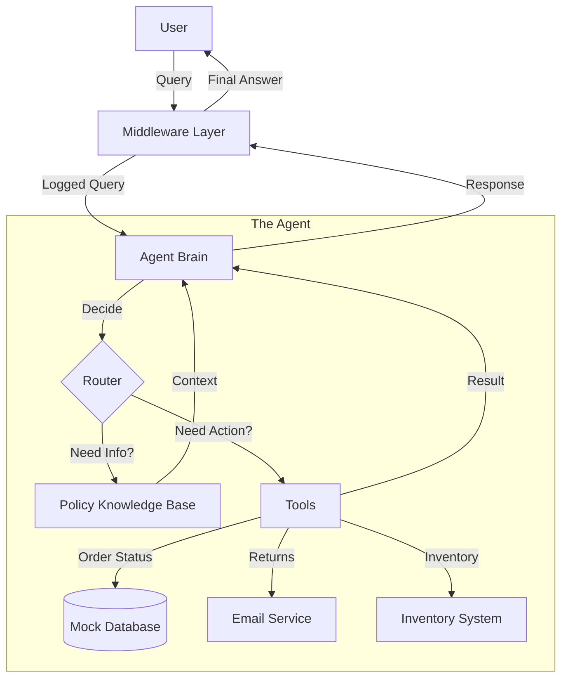

# LangChain Zero-to-Hero Part 6: The Capstone Project (Building a Real AI Agent)

**Congratulations!** You've made it to the final chapter.

Across the last five parts, you've learned the individual superpowers of modern AI development:

* **Part 1:** How to talk to LLMs and stream responses
* **Part 2:** How to give your agent tools to interact with the world
* **Part 3:** How to give your agent memory and context
* **Part 4:** How to give your agent knowledge (RAG)
* **Part 5:** How to control your agent with middleware

Now, we're going to stop building "demos" and build a **real application**.

## The Mission: Build an Enterprise Customer Service Agent

Imagine you've been hired by an e-commerce company called "TechGear." They are drowning in support tickets and need an AI agent that can handle real customer issues autonomously.

This isn't a toy. This agent needs to:

1. **Check real order statuses** (Database lookup)
2. **Process returns** (Transactional action)
3. **Answer policy questions** (RAG from documents)
4. **Check inventory** (Real-time data)
5. **Log everything** for compliance (Middleware)
6. **Be safe and reliable** (Error handling)

We will build this entire system in one file: `scripts/06_complete_application.py`.

---

## The Architecture

Before we write code, let's look at what we're building.



This architecture separates concerns:

* **Middleware** handles the "boring stuff" (logging, safety, rate limiting).
* **The Agent** handles the reasoning.
* **Tools** handle the actual work.
* **RAG** handles the knowledge.

---

## Step 1: Setup and Dependencies

Create a new file called `scripts/06_complete_application.py`.

First, we need our imports. Notice how we're pulling from everything we've learned:

```python
import os
from datetime import datetime
from typing import Any

from dotenv import load_dotenv
from langchain.agents import AgentState, create_agent
from langchain.agents.middleware import AgentMiddleware
from langchain.tools import tool
from langchain_community.embeddings import FastEmbedEmbeddings
from langchain_community.vectorstores import FAISS
from langchain_core.documents import Document
from langchain_groq import ChatGroq
from langchain_text_splitters import CharacterTextSplitter
from langgraph.runtime import Runtime

# Load environment variables
load_dotenv()
```

---

## Step 2: Define the Tools (The "Hands")

Our agent needs to interact with the company's systems. In a real app, these would call REST APIs or SQL databases. For this capstone, we'll simulate them with mock data, but the *structure* is identical to production code.

### Order System

```python
@tool
def get_order_status(order_id: str) -> str:
    """Get the status of a customer order."""
    # Simulating a database lookup
    orders = {
        "ORD001": "Shipped - arriving tomorrow",
        "ORD002": "Processing - will ship today",
        "ORD003": "Delivered on Nov 28",
    }
    return orders.get(order_id, "Order not found")
```

### Return System

```python
@tool
def initiate_return(order_id: str, reason: str = "Not specified") -> str:
    """Start a return process for an order."""
    # Simulating a backend transaction
    return (
        f"Return initiated for order {order_id}. Reason: {reason}. "
        "Return label sent to email."
    )
```

### Inventory System

```python
@tool
def check_inventory(product_name: str) -> str:
    """Check if a product is in stock."""
    inventory = {
        "laptop": "In stock - 15 units available",
        "phone": "Low stock - 3 units remaining",
        "tablet": "Out of stock - restocking Dec 5",
    }
    return inventory.get(product_name.lower(), "Product not found")
```

**Pro Tip:** Notice the docstrings? The LLM uses these to understand *when* to use each tool.

---

## Step 3: The Knowledge Base (The "Brain")

Customer service agents need to know company policies. We don't want to hardcode these into the prompt because they change often. Instead, we use RAG.

```python
# 1. The Raw Knowledge
knowledge_docs = [
    "Our return policy allows returns within 30 days of purchase for a full refund.",
    "Shipping is free for orders over $50. Standard shipping takes 3-5 business days.",
    "We offer 24/7 customer support via chat, email, and phone.",
    "All products come with a 1-year manufacturer warranty.",
    "You can track your order using the order number sent to your email.",
]

# 2. Process Documents
documents = [Document(page_content=doc) for doc in knowledge_docs]
text_splitter = CharacterTextSplitter(chunk_size=200, chunk_overlap=20)
docs = text_splitter.split_documents(documents)

# 3. Create Vector Store
embeddings = FastEmbedEmbeddings()
vectorstore = FAISS.from_documents(docs, embeddings)
retriever = vectorstore.as_retriever(search_kwargs={"k": 2})

# 4. Wrap as a Tool
@tool
def company_policies(query: str) -> str:
    """Search company policies, shipping info, and customer service guidelines."""
    docs = retriever.invoke(query)
    return "\n\n".join([doc.page_content for doc in docs])
```

Now, when a user asks "What is your return policy?", the agent will use the `company_policies` tool to look it up.

---

## Step 4: The Middleware (The "Manager")

We need to log every interaction for quality assurance. We'll use the middleware pattern we learned in Part 5.

```python
class CustomerServiceMiddleware(AgentMiddleware):
    """Middleware for logging customer interactions."""

    def before_agent(
        self, state: AgentState, runtime: Runtime
    ) -> dict[str, Any] | None:
        print(f"\n{'=' * 50}")
        print(
            f"🕐 {datetime.now().strftime('%H:%M:%S')} - Processing customer query..."
        )
        return None

    def after_model(self, state: AgentState, runtime: Runtime) -> dict[str, Any] | None:
        print("✅ Response ready")
        return None
```

---

## Step 5: Assembling the Agent

Now we bring it all together.

```python
llm = ChatGroq(model="llama-3.1-8b-instant", temperature=0.7)

system_prompt = """You are a helpful customer service agent for an e-commerce company.

Your responsibilities:
- Help customers with order inquiries
- Process returns and exchanges
- Check product inventory
- Answer policy questions using the knowledge base

Be friendly, professional, and efficient.
Always verify order IDs before processing requests.

CRITICAL: When using a tool, output ONLY the tool call. Do not add any conversational text before or after the tool call.
If you need to say something, do it in a separate turn AFTER the tool execution."""

tools = [get_order_status, initiate_return, check_inventory, company_policies]

agent = create_agent(
    model=llm,
    tools=tools,
    middleware=[CustomerServiceMiddleware()],
    system_prompt=system_prompt,
)
```

---

## Step 6: Running the Simulation

Let's test our agent with real-world scenarios. We'll create a helper function to manage the chat loop.

```python
def handle_customer(customer_id: str, query: str):
    """Handle a customer service interaction."""
    try:
        # We use a recursion_limit to prevent the agent from getting stuck in loops
        result = agent.invoke(
            {"messages": [{"role": "user", "content": query}]},
            config={"recursion_limit": 10},
        )
        return result["messages"][-1].content
    except Exception as e:
        return f"Error processing request: {str(e)}"

# Let's run some test cases!
print("\n" + "=" * 70)
print("CUSTOMER SERVICE AGENT - LIVE DEMO")
print("=" * 70)

# Scenario 1: Where is my order?
response1 = handle_customer(
    "CUST123", "Hi, I'd like to check the status of my order ORD001"
)
print(f"\n📞 Agent: {response1}")

# Scenario 2: I want to return something
response2 = handle_customer(
    "CUST456", "I need to return order ORD002, the product doesn't fit"
)
print(f"\n📞 Agent: {response2}")

# Scenario 3: Policy question (RAG)
response3 = handle_customer("CUST789", "What's your return policy?")
print(f"\n📞 Agent: {response3}")

# Scenario 4: Sales inquiry (Inventory)
response4 = handle_customer("CUST321", "Do you have laptops in stock?")
print(f"\n📞 Agent: {response4}")
```

---

## Run It

Execute the script:

```bash
python scripts/06_complete_application.py
```

You should see the agent handling each request intelligently:

1. It looks up ORD001 and says it's arriving tomorrow.
2. It initiates a return for ORD002.
3. It searches the policy docs to explain the 30-day return window.
4. It checks inventory and confirms laptops are in stock.

## Conclusion: You Are Now an AI Engineer

Take a step back and look at what you've built.

This isn't just a script. It's a **cognitive architecture**. You have:

* **Perception**: The agent "hears" the user.
* **Memory**: It maintains conversation state.
* **Knowledge**: It retrieves policy documents.
* **Action**: It manipulates external systems (orders, inventory).
* **Oversight**: Middleware watches every move.

This is the exact same architecture used by Fortune 500 companies to build their internal AI tools. The only difference is scale.

### Where to Go From Here?

You have the foundation. Now, build something of your own:

* **Connect to real APIs**: Replace the mock tools with Gmail, Slack, or GitHub APIs.
* **Add a UI**: Wrap this agent in a Streamlit or FastAPI app.
* **Deploy it**: Put it on a cloud server and let others use it.

The world of AI engineering is wide open. You have the tools. **Go build.**
